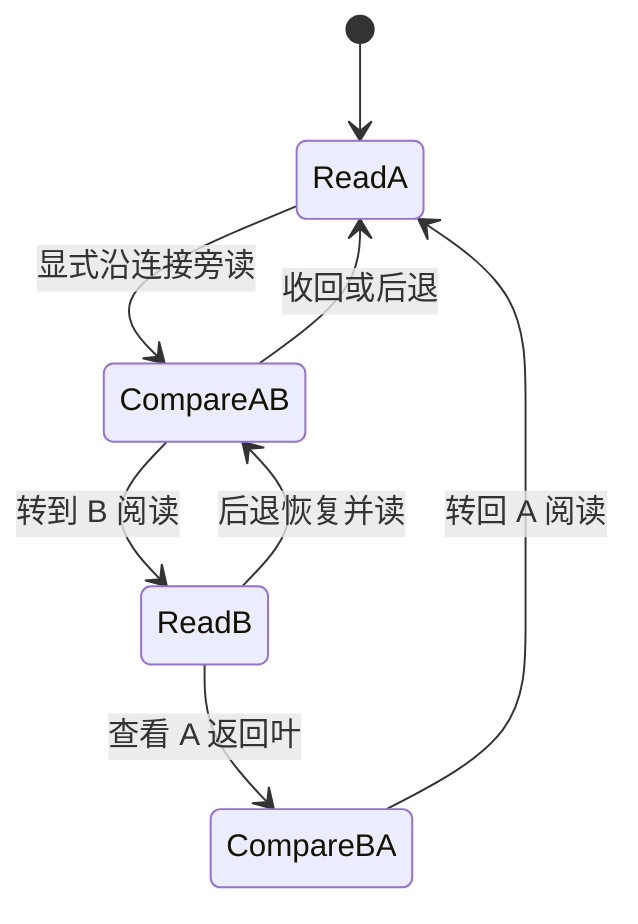

# 连续文档空间：空间模型与注意力迁移

## 结论

推荐把产品建模为一个**持久文档集合上的、随当前注意力重新投影的空间**，而不是保存若干打开窗口的位置。每个未归档或已归档的 `Document` 都一直属于空间；当前文档只决定此刻哪些版本正文进入阅读面、哪些关系靠近、哪些成员压成屏幕边缘的叠页。切换当前文档不会创建、关闭或删除任何文档。

空间有三个必须分开的层次：

1. **持久成员层**：`Document`、不可变 `Revision`、`Anchor`、`Connection` 和归档状态。它回答“什么存在”。
2. **阅读位置层**：某个 document 的某个 revision、精确 passage 和正文滚动恢复点。它回答“读者在哪里”。
3. **短暂投影层**：当前正文、并读正文、边缘折页、叠页、关系带和预览。它回答“此刻怎样看见已有对象”。这些投影不是新的持久实体。

由此产生的关键决定是：**不持久化文档 XYZ，不保存打开的 view 列表，也不让 DOM 是否挂载决定空间成员资格。** 布局可在每次注意力改变后重新计算；文档身份、版本身份、阅读位置和返回路径仍然稳定。

比较过的另外两种策略都不推荐。永久桌面地图会让关系距离与物理距离互相冲突，并把导入后的碰撞整理交给读者；把所有标题铺成屏幕边框会在数百文档时退化成目录。推荐的关系带 + 有界叠页只持久化真实身份和连接，同时让全部成员通过边缘计数与可进入的 stack 保持可发现。

## 1. 空间中的对象

### 1.1 一个 Document，一组可被投影的 Revision

`DocumentPresence` 表示一个稳定 `DocumentId` 在空间中的成员资格。它只保存或引用目录元数据，例如 title、path、current revision、archived；它不是纸页组件，也不携带 scroll、pose 或 hover。

服务端的 membership 是完整事实，客户端的 manifest 只是分页知识。尚未加载某份 metadata 不表示该文档不在空间；partial manifest 必须把未加载成员保留为 stack 的未展开余量：

```ts
type ManifestKnowledge =
  | { kind: "unknown" }
  | {
      kind: "partial";
      loaded: ReadonlyMap<DocumentId, DocumentSummary>;
      seen: number;
      nextCursor: string;
    }
  | {
      kind: "complete";
      loaded: ReadonlyMap<DocumentId, DocumentSummary>;
      total: number;
    };
```

partial 时只显示“已见 N，还有更多”；不能用当前数组长度冒充空间总量。

`RevisionNode` 是关系图上的节点。连接端点绑定 revision 内的精确范围，因此关系距离必须在 `RevisionId` 上计算。版本沿革本身不构成内容连接：B v3 与 B v5 属于同一 Document，但不能因为同属 B 就把指向 v3 的连接偷偷画到 v5。

一个 Document 可以同时需要多个 revision 投影。例如 A v2 连接 B v3，而 B 当前已是 v5。空间显示一个 B 的 `DocumentBundleProjection`：与关系相接的前叶明确写 `v3`，较后的版本叶提示“当前 v5”。选择前叶读到的仍是 v3；选择 v5 是另一个明确动作。这里出现两张版本叶，但空间中仍只有一个 B Document。

### 1.2 阅读位置不是文档，也不是纸页

```ts
type ReadingPosition = {
  documentId: DocumentId;
  revisionId: RevisionId;
  focus: AnchorInput | null; // revision-bound exact passage
  scroll: ScrollRestorePoint; // session-only; source offset preferred, px fallback
};

type AttentionState = {
  current: ReadingPosition;
  comparison: ParallelComparison | null;
  selectedConnectionId: ConnectionId | null;
  edgeBrowse: EdgeBrowseState;
};
```

`ReadingPosition` 可以被导航历史保存和恢复。纸页 DOM 卸载后，它仍然有效。`focus` 与 `scroll` 要分开：前者有内容语义，可用于定位 passage；后者只是恢复阅读进度，不能成为连接端点。

hover、键盘焦点或搜索结果选中可产生一个不进入历史的 `TargetPreview`，它只有标题、版本、短摘录和目标身份。用户显式执行“旁读”后，才建立可滚动的 `ParallelComparison`。comparison 可以由真实 Connection 建立，也可以只是读者明确要求把无连接文档并排查看；后者不产生 beam 或语义关系。两种状态都不能与瞬时 preview 混在一起。

### 1.3 投影是一组有上限的渲染对象

```ts
type SurfaceProjection =
  | { kind: "reading"; position: ReadingPosition; role: "current" }
  | { kind: "reading"; position: ReadingPosition; role: "companion" }
  | {
      kind: "leaf";
      documentId: DocumentId;
      revisionId: RevisionId;
      band: 1 | 2;
    }
  | { kind: "bundle"; documentId: DocumentId; leaves: readonly RevisionLeaf[] }
  | {
      kind: "stack";
      stackId: StackId;
      members: MemberWindow;
      total: CountKnowledge;
    };
```

`reading` 才挂载可选择、可滚动的正文。`leaf` 只需标题、版本、关系摘要和必要的 passage 摘要。`stack` 是一个集合投影，不为其每个成员生成隐藏纸页。折起、展开和收回只改变 `SurfaceProjection`；不要给它们实现 `openDocument` / `closeDocument` 领域动作。

## 2. 注意力相对的空间

空间使用当前 `RevisionNode` 作为原点，每次 current 变化都派生新的局部投影。这样“所有文档都在空间中”不等于“所有文档有永远不变的物理坐标”。永久坐标会让新连接、版本和大量导入造成碰撞，也会把关系阅读退化成手动整理桌面。

推荐的投影层级如下：

| 区域     | 成员条件                                                      | 可见形态                                                | 正文策略                                          |
| -------- | ------------------------------------------------------------- | ------------------------------------------------------- | ------------------------------------------------- |
| 阅读面   | 当前 `ReadingPosition`                                        | 中央、正面、完整纸页                                    | 挂载虚拟化正文                                    |
| 并读位   | 用户显式要求并排查看的目标；可能来自连接，也可能来自边缘 leaf | 当前旁边的第二张可读纸页                                | 挂载目标 revision 正文；无 Connection 时不画 beam |
| 近缘     | 与 current revision 有已证明的一跳连接                        | 露出标题与版本的折页/小叶；选中连接优先展开             | 不挂完整正文                                      |
| 次缘     | 有已证明的两跳连接                                            | 更深的叠页；显示“2 跳”及经过的入口文档                  | 不挂完整正文                                      |
| 空间边缘 | 尚未证明在两跳内的所有其他 DocumentPresence                   | 一个或多个可操作叠页                                    | 只挂当前窗口中的成员摘要                          |
| 归档缝   | archived 文档                                                 | 独立的压缩叠页；若它是所选连接端点则临时进入近缘/并读位 | 默认不挂正文                                      |

“近”“远”只陈述已知图距离。空间边缘应叫“空间中的其他文档”或“其余文档”，不能叫“无关文档”；未加载完的关系可能会证明其中某份文档其实很近。

### 2.1 关系距离

关系距离是在不可变 revision 节点图上的最短连接跳数：

$$d(r_a,r_b)=\min\{\text{显式 Connection 路径的边数}\}$$

只显示三个关系层级：0（current）、1（直接相连）、2（通过一个明确的 revision 节点相连）。大于 2 的精确层级对当前阅读帮助很小，且会迫使系统读取大图；它们与未知成员一起留在空间边缘。关系类型、连接数量、更新时间或标题相似度可以影响同一层内的稳定排序，但不能改变 hop distance。

图遍历不跨越同一 Document 的不同 Revision。若 A v2→B v3 且 B v5→C v1，不能推出 A v2 到 C v1 为两跳。只有 A v2→B v3 且 B v3→C v1 才成立。

### 2.2 不完整知识必须进入类型

```ts
type RelationKnowledge =
  | { kind: "unknown" }
  | { kind: "loading"; requestId: string; center: RevisionId }
  | {
      kind: "partial";
      center: RevisionId;
      proven: readonly ProvenDistance[];
      nextCursor: string;
    }
  | {
      kind: "complete";
      center: RevisionId;
      proven: readonly ProvenDistance[];
    };

type ProvenDistance = {
  revisionId: RevisionId;
  documentId: DocumentId;
  minHop: 1 | 2;
  viaRevisionId: RevisionId | null;
};
```

`partial.proven` 中已经返回的条目可以向内移动，因为它们的近距离已被证明；未出现的成员继续保持“其余文档”，不能推断距离。只有 `complete` 才能说某成员不在两跳内。布局文案不得把 `unknown` / `partial` 伪装成“没有连接”。

### 2.3 同一层内的排序

推荐使用完全可解释的次序：

1. 返回来源（前一 current）保留一个专门位置，不参与普通排序；
2. 已选连接的端点；
3. 与 current focus 相交或最近的连接端点；
4. relation 的固定产品顺序；
5. title、path、`DocumentId` 作为稳定 tie-breaker。

不要用未来 AI 相关度、文本相似度或未经说明的热度。多条连接指向同一 revision 时只出现一个 revision leaf，并在叶上聚合连接数量；读者选中某条连接后再显示其精确 passage 和 relation。

## 3. 边缘折页和叠放

### 3.1 折页必须传达三件事

每个边缘对象即使处于最小形态，也必须让读者知道：

- 这是可进入的文档或文档集合，不是装饰阴影；
- 它代表哪类成员（直接连接、两跳、其余文档、归档）；
- 它里面有多少成员；若目录尚未完成，则明确显示“已见 N，还有更多”，不用虚假的总数。

单个 leaf 静止时允许标题两行截断，但获得焦点或进入 fan 后必须显示完整标题、path、revision。标题不能只靠悬停读取，因为键盘和触摸没有 hover。

### 3.2 等距文档的折叠规则

每个距离带最多直接暴露 8 个 leaf；超过部分压成 stack。stack 在 DOM 和场景图中都是一个对象，最多画 3 层露边来表达厚度，旁边给出真实数量。数字 8 是初始交互预算，不是领域常量，后续可按可用宽度调整，但同一帧的上限必须明确。

一百份同等相关的文档不会形成一百张重叠纸页：前 8 个按上述稳定次序露出，余下 92 个形成一个“直接连接 · 92”叠页。若一个 stack 超过可一次浏览的成员数，它仍是同一个 stack，不在屏幕边缘再堆出十几个分页 stack。

### 3.3 进入叠页深处，而不变成侧栏

stack 有三种呈现状态：

```ts
type EdgeBrowseState =
  | { kind: "collapsed" }
  | {
      kind: "fanned";
      stackId: StackId;
      cursor: StackCursor;
      members: readonly DocumentPresence[]; // 最多 7
      focusedIndex: number;
      nextCursor: StackCursor | null;
      previousCursor: StackCursor | null;
    };
```

激活 stack 后，纸页从原边缘**向场景内部展开成最多 7 张可聚焦的短叶**；current 正文仍在原处，stack 的根仍连在原边缘，因此读者始终知道自己从哪里进入。翻到下一窗口时，下一批短叶替换 fan 内的叶，根和 current 不动。收回 fan 只恢复叠页，不关闭任何文档。

这不是隐藏侧栏，原因是：

- fan 位于同一空间投影中，有明确的边缘根与深度；
- current、连接带和返回来源仍可见；
- hover/focus 某个短叶显示 `TargetPreview`；激活短叶会把它作为 companion 并排呈现，只有再明确“转到这里阅读”才改变 current；
- 深入过程是 stack 自己的窗口游标，不产生新的目录层级或模式开关。

“其余文档”可能很多。它使用单一连续成员序列和游标窗口；排序建议为最近更新优先，再按 title/path/id 稳定排序。fan 打开时在客户端冻结该次 `DocumentId[]` 顺序；后台新取得或更新的目录 metadata 不重排正在操作的 fan，收起后再合并到下一次展开。

### 3.4 误触约束

hover 或键盘 focus 只能提供 `TargetPreview`，不能改变 current。第一次激活边缘 stack 是 fan；激活 fan 内 leaf 会显式建立 companion comparison 并写阅读历史；改变 current 还需要明确 promote。具体鼠标、键盘和触摸映射由手势设计负责，不允许 pointer enter 或滚动穿越直接导航。

视觉层可以在稳定 hover 后临时扇开标题作为 `VisualPeek`，但 pointer leave 后收回，且不写 `EdgeBrowseState`、焦点或历史。click/Enter 才把 stack 锁为 `fanned`，使触摸和键盘得到相同可操作状态。

## 4. A → B 的注意力迁移与返回

推荐把瞬时预判、显式旁读和转去阅读分成三个层次。



1. **预判目标**：hover/focus 只出现 B 的标题、版本、关系和短摘录；A 仍是 current，不挂 B 正文，也不写导航历史。
2. **沿连接旁读**：用户显式 follow 后，B 的精确 revision 和 target passage 进入 companion。A 的 passage、B 的 passage 和所选 Connection 构成 linked `ParallelComparison`。建立前先保存 A 单页快照，因此 Back 可以收回旁读。
3. **转到 B 阅读**：只有在 B 内容已可读后，提交第二次 attention transition。先把 A+B comparison 的完整 `AttentionSnapshot` 压入返回历史，再让 B 成为 current。
4. **A 的去处**：A 不消失。它成为 B 旁边固定的“返回叶”，保留标题、revision、原 passage 和返回语义；如果两者有连接，也同时属于 B 的一跳带。普通近缘重排不能把返回叶挤进 overflow stack。
5. **后退**：从 B 后退先恢复 A current + B companion 的 comparison；再后退恢复建立旁读前的 A。恢复精确 revision、focus 和 scroll，不重新运行搜索或猜测 passage。异步关系数据可刷新折页，但不能改写恢复的阅读位置。
6. **再沿 B→C**：保存 B 快照后 C 成为 current。返回链保存的是阅读位置与 comparison 历史，不是一批仍然“打开”的窗口。

```ts
type ParallelComparison = {
  origin: ReadingPosition;
  target: ReadingPosition;
  status: "loading" | "ready" | "failed";
} & (
  | { kind: "linked"; connectionId: ConnectionId }
  | {
      kind: "unlinked";
      provenance: "edge" | "search" | "answer" | "history" | "link-draft";
    }
);

type AttentionSnapshot = {
  current: ReadingPosition;
  comparison: ParallelComparison | null;
  selectedConnectionId: ConnectionId | null;
  edgeBrowse: EdgeBrowseState;
};
```

返回历史保存用户可感知的注意力状态，不保存 beam 像素坐标、DOM 节点、折页 transform 或完整响应对象。相机是否进入同一快照由手势组统一，但恢复后的 current 与 passage 不能依赖相机恢复才成立。

若用户明确收回某个 comparison，当前历史条目应同步去掉该 `comparison`；之后返回到这个条目时恢复 current 与阅读位置，但不违背刚才的收回意图重新展开 companion。这是对会话快照的更新，不是关闭文档或删除 Connection。

### 4.1 从无连接文档 C 开始

C 通过“其余文档”stack 被发现。hover/focus C 先显示标题、版本和短摘录的 `TargetPreview`；激活后 C 成为可滚动、可选择的 companion，便于比较或作为创建新连接的第二端。这个 unlinked `ParallelComparison` 写阅读历史，但不画假的 beam。再明确 promote 后 C 成为 current，旧 current 成为返回叶。并排只表示读者的临时阅读上下文，不表示已有语义关系。

搜索结果、导入完成或 AI 的“设置当前文档”也使用同一个 `commitAttention(target, provenance)`，其中 provenance 只用于反馈与历史标签，不生成 Connection。

## 5. 数据读模型

现有 `ls` 能分页取得所有文档元数据，`open_document` 能分页取得一个文档的直接连接。保留这两条路径，另新增一个有界 neighborhood 只读投影来证明两跳距离；不新增持久领域实体。

### 5.1 复用现有目录分页

启动后分别分页读完 active 与 archived 的 `ls` 元数据，不读正文。两套目录各自维护 `loading / partial / complete / error`；active 完成不能让归档缝声称完整。complete 前 stack 只显示“已载入 N，仍在载入”，complete 后才可把数组长度当准确数量。

fan 打开时复制当前符合该 stack 的 `DocumentId[]` 作为本地窗口序列。后台目录页、创建、编辑或归档结果继续合并到 manifest store，但不插入正在操作的 fan；收起并再次展开时使用新序列。这样得到稳定浏览而无需引入服务端 snapshot 生命周期。

### 5.2 Bounded neighborhood

```ts
type NeighborhoodPage = {
  centerRevisionId: RevisionId;
  nodes: readonly {
    documentId: DocumentId;
    revisionId: RevisionId;
    minHop: 1 | 2;
    viaRevisionId: RevisionId | null;
    directConnectionCount: number;
    relationKinds: readonly ConnectionRelation[];
  }[];
  nextCursor: string | null;
};
```

服务端只遍历两跳、只返回身份和聚合摘要，不返回正文、完整 anchor quote 或所有 connection。它必须以确切 `centerRevisionId` 为中心并给出稳定 cursor；客户端不能把 document current revision 代替历史 center。精确 direct beam 仍由 `open_document` 的 Connection/Anchor 页提供，避免让空间索引成为第二套连接真相。

建议限制每页 100 个 neighborhood node，并允许继续分页。两跳结果很多时，客户端只逐页证明距离并折叠，资源消费随当前可感知 fan 和少量关系摘要有界。实现可使用数据库索引/有界查询；不得对每个目录成员发一次请求。

### 5.3 加载与竞态

每次 neighborhood 请求都带 `centerRevisionId + generation`。响应只有在二者仍匹配当前注意力时才可改变 band；过期响应只进入按 revision 缓存，不能重排新 current 的空间。

current 改变后立即显示目标正文和所有已知 `DocumentPresence` 的边缘 stack；近缘/次缘处于 loading，而不是先假设其他文档很远。目标 revision 尚未返回时保留旧 current 与一个带目标身份的 pending leaf；成功后才 commit attention，失败则 leaf 显示重试并保持旧 current。

## 6. 程序实体与归属

| 程序实体                             | 身份键                           | 生命周期/所有者           | 是否持久               | 关键不变量                                               |
| ------------------------------------ | -------------------------------- | ------------------------- | ---------------------- | -------------------------------------------------------- |
| `DocumentRecord` / `DocumentSummary` | `DocumentId`                     | 数据库 / manifest         | 是                     | 折叠与否不改变成员资格                                   |
| `DocumentRevision`                   | `RevisionId`                     | 数据库 / revision cache   | 是                     | 内容不可变；current revision 只是 Document 指针          |
| `Anchor`                             | `AnchorId`                       | 数据库                    | 是                     | 始终绑定一个 revision 的 exact range                     |
| `Connection`                         | `ConnectionId`                   | 数据库                    | 是                     | 两端 revision 不因编辑迁移                               |
| `ReadingPosition`                    | 复合值                           | 单浏览器会话、历史        | 否                     | documentId 与 revisionId 必须匹配                        |
| `AttentionState`                     | 单 active state                  | 单浏览器/App 实例         | 否                     | 非空空间恰有一个 current                                 |
| `TargetPreview`                      | target identity                  | hover/focus 瞬时状态      | 否                     | 不挂正文、不写历史、不改变 current                       |
| `ParallelComparison`                 | 两个 positions + 可选 connection | 当前 attention / 阅读历史 | 否                     | companion 不等于 current；unlinked 不画 beam、不创建关系 |
| `DocumentPresence`                   | `DocumentId`                     | manifest projection       | 否（由持久元数据派生） | 每个成员一次；可含多个 revision leaf                     |
| `RelationKnowledge`                  | center revision                  | revision-scoped cache     | 否                     | partial 只证明已有条目，不证明缺席                       |
| `SurfaceProjection`                  | projection key                   | 当前渲染帧/布局           | 否                     | mount/unmount 不改变领域状态                             |
| `EdgeStackProjection`                | stack id + 本地冻结成员序列      | 当前 attention            | 否                     | 是集合窗口，不拥有成员                                   |
| `BeamGeometry`                       | connection + rendered endpoints  | 布局测量缓存              | 否                     | 仅在两端实际投影可测时绘制                               |

应替换当前代码中以 `views[]` 累计打开纸页、`close-view` 删除视图、`read/overview` 切模式的主模型。可以保留 `ViewId` 作为某次正文投影的内部 key，但它不能继续充当“文档是否在空间”的证据。`DocumentPresence` 不需要为每个 Document 创建 React component；manifest store 中的一行数据就足以表示成员。

可由类型静态保证的约束包括：空空间不能有 current；非空 `AttentionState` 恰有 current；comparison 两端都是完整 `ReadingPosition`；只有 linked comparison 才有 `ConnectionId`；relation knowledge 与 center revision 绑定；历史恢复不接收 `SurfaceProjection`。运行时需要验证 document/revision 配对、anchor quote 与 offset、服务端 cursor 和本地 fan 冻结序列的有效性。

## 7. 与其他设计组的共享契约

### reading-flow

- 区分瞬时 `TargetPreview`、显式 `showCompanion`（有连接时可由 `follow` 触发）建立的 `ParallelComparison` 与 `promote`；只有后两者写阅读历史，hover 不导航。
- 搜索、导入、创建、AI 设置 current 都调用同一个 attention transition，并保留旧 current 返回快照。
- “收回旁读”“收起 fan”是呈现动作，不写成关闭文档。
- 历史 revision 进入 current/companion 时始终显示 revision，不能自动替换为最新版。

### visual-motion

- 为 current、companion、返回叶、关系 leaf、unknown/other stack、archived stack 提供不同的可感知层级；本文件不规定色值。
- stack 展开前后须保留同一个边缘根；中断后落在 collapsed 或 fanned 的合法状态。
- leaf 聚焦时展示完整长标题；静止截断不承担唯一识别责任。

### gestures-performance

- 输入映射到 `fanStack`、`previewLeaf`、`promote`、`collapseFan`、`back` 等语义动作，不直接改领域成员。
- 同时可读正文默认上限为 current + 一个 companion；leaf/stack 不挂正文。
- 每带 8 个裸露 leaf、fan 7 个成员、stack 最多 3 层视觉露边是初始渲染预算，须按实测调整但保持有界。
- 几何、beam 测量和动画状态不进入导航历史。

## 8. 验收场景

1. **连接后转读并返回**：A v2 passage 连接 B v3。hover 只预览身份；显式 follow 后 A current、B v3 companion；promote 后 B v3 current、A 返回叶；第一次 Back 恢复 A+B comparison，第二次 Back 恢复旁读前的 A 单页、passage 和 scroll。
2. **同一 Document 的不同版本**：B 当前 v5，但连接指向 v3。近缘显示 B bundle，连接落在 v3；读者可分别进入 v3 或明确转到 v5；任何一步都不把 anchor 迁到 v5，也不制造第二个 B Document。
3. **发现无已知连接的 C**：C 始终在“其余文档”stack 的 manifest 序列中。fan 后 hover 只预览；激活成为 unlinked companion 并写历史，可在 A/C 正文选择两端创建连接；promote 后 C 成为 current。创建 Connection 前 A 与 C 之间不出现 beam。
4. **一百份同等直接关系**：近缘最多 8 个 leaf，其余形成一个带真实数量的 stack；fan 每次最多 7 个，可遍历到第 100 个；current 一直可见且没有 100 个隐藏正文节点。
5. **关系分页未完**：第一页证明 D 为一跳后 D 向内移动；未返回的 E 仍标为“其余/关系仍在载入”，不能显示“无连接”。完成页后才可确定 E 不在两跳内。
6. **快速 A→B→C**：B 的 neighborhood 在 C 已 current 后返回，不得重排 C 的 band；Back 到 B 时可复用该 revision-scoped 缓存。
7. **归档连接端点**：归档 B 通常在归档缝；从 A 选择指向 B 的连接时 B 的确切 revision 可进入 companion，仍带 archived 标识；这不自动恢复 B。
8. **折页误触**：pointer hover、焦点经过或滚动 fan 都不改变 current；preview 失败保持原 current；收回 fan 不改变 Document 数量或 Connection。

## 9. 需要实测或产品验证的假设

- 8 个近缘 leaf、7 个 fan 成员在桌面和 390px 投影上是否仍能读清标题；若空间不足，减少裸露数量，不增加 DOM 总量。
- 两跳信息是否确实帮助导航。若测试显示读者只使用一跳与“其余文档”，可以删除两跳投影和 neighborhood 的第二层，而不改变持久模型。
- 更新时间排序是否会让“其余文档”stack 感到跳动；先用 fan 打开期间冻结成员顺序来验证。
- “第一次选中 preview、第二次 promote”是否能被用户理解。应观察误触率与从 fan 到正文的完成率，并让阅读流程提供清楚的动作文字。
- version bundle 是否足以让读者理解“同一文档、不同版本”。至少用“连接版本 v3 / 当前版本 v5”的真实内容场景测试，不能只看静态 mockup。
